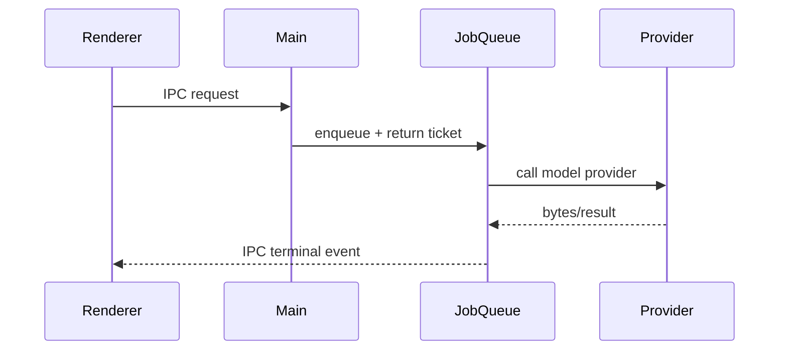

# Design Document - <FEATURE>

> Source of truth: `requirements.md` in this directory.

## Overview

<Describe the implementation approach and map it to R1..Rn and INV-1..INV-n.>

## Architecture

## Components and Interfaces

### <Component>

<Interface signature and integration points.>

## Data Models

| Table/Field | Type | Notes |
| :--- | :--- | :--- |

## Correctness Properties

### INV-1: <Name>

*For any* ...

**Validates:** Requirements x.y.

## Testing Strategy

| INV | Test Level | Approach |
| :--- | :--- | :--- |

## Migration And Cutover

| Phase | Work | Reversible |
| :--- | :--- | :--- |
