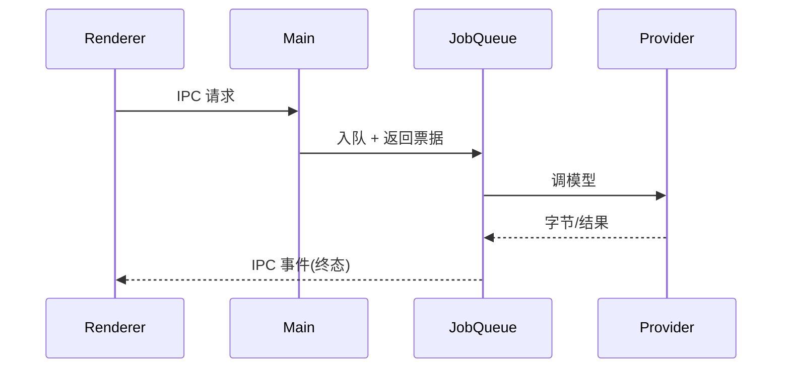

# Design Document — <FEATURE>

> Source of truth：同目录 `requirements.md`。

## Overview

<总体改造思路，对应 R1..Rn + INV-1..INV-n。>

## Architecture

## Components and Interfaces

### <组件>
<接口签名 + 集成点。>

## Data Models

| 表/字段 | 类型 | 备注 |
| :--- | :--- | :--- |

## Correctness Properties

### Property 1: <名>
*For any* ...

**Validates: Requirements x.y**

## Testing Strategy

| INV | 测试层 | 思路 |
| :--- | :--- | :--- |

## Migration & Cutover

| 阶段 | 内容 | 可逆性 |
| :--- | :--- | :--- |
