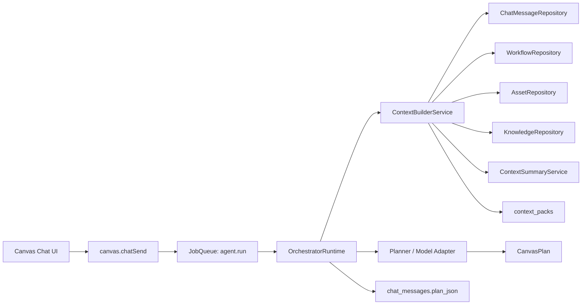

# Design - Conversation Context Engine

## Overview

The Conversation Context Engine turns Agent runs from single-message planning
into bounded, replayable, scoped context planning. It adapts cc-haha concepts to
ComicCanvas:

- cc-haha `history.jsonl` -> ComicCanvas `chat_messages` by workflow.
- cc-haha session history pages -> workflow chat/run history APIs.
- cc-haha user/system context -> agent policy, workflow metadata, canvas
  summary, and selected assets.
- cc-haha memory/retrieval attachments -> knowledge chunks and typed
  `ContextSource` rows.
- cc-haha `/compact` -> local Conversation Summary + compaction boundary.

Unlike cc-haha, ComicCanvas context is stored in SQLite and tied to workflow,
agent run, graph, asset, and knowledge scopes.

## Architecture



## Component Responsibilities

| Component | Responsibility |
| :--- | :--- |
| `ContextBuilderService` | Applies policy/scope, gathers sources, budgets tokens, persists Context Pack. |
| `ChatContextSource` | Loads recent `chat_messages`, converts plans/tool results to compact summaries. |
| `CanvasContextSource` | Builds graph/node/edge/selection summaries from workflow graph snapshots. |
| `AssetContextSource` | Adds selected asset metadata and safe refs. |
| `KnowledgeRepository` | Ingests, chunks, retrieves, deletes, rebuilds local knowledge. |
| `KnowledgeContextSource` | Calls retrieval and converts chunks into citable ContextSources. |
| `ContextSummaryService` | Summarizes older conversation history and records compaction boundaries. |
| `ContextRedactor` | Redacts secrets, auth headers, hidden prompts, unsafe absolute paths. |
| `ContextTokenBudgeter` | Deterministic approximate token counts, source ordering, trimming, omissions. |
| `OrchestratorRuntime` | Builds context inside `agent.run` job before planner/model invocation. |
| `ContextInspector` | Debug/read API for showing context sources, excerpts, redactions, warnings. |

## Orchestrator Integration

Current planner input:

```ts
interface OrchestratorPlannerInput {
  runId: string
  messageId: string
  message: string
  agentId: string
}
```

Target planner input:

```ts
interface OrchestratorPlannerInput {
  runId: string
  messageId: string
  workflowId?: string
  message: string
  agentId: string
  contextPack: ContextPack
  renderedContext: string
}
```

`canvas.chatSend` should stay fast. It persists the message and enqueues
`agent.run`. The job handler then:

1. resolves agent definition and context policy,
2. builds `ContextBuildInput`,
3. calls `ContextBuilderService.build`,
4. stores `contextPack.id` on `agent_runs.context_pack_id`,
5. passes `contextPack` and `renderedContext` to planner/model,
6. persists resulting plan JSON and emits `canvas.planReady`.

## Context Build Input

Extend `ContextBuildInput`:

```ts
interface ContextBuildInput {
  agentId: string
  runId: string
  messageId: string
  workflowId?: string
  userMessage: string
  scope: KnowledgeScope
  selectedNodeIds: string[]
  selectedAssetIds: string[]
  graphSnapshot?: unknown
  tokenBudget: number
  policyOverride?: Partial<AgentContextPolicy>
}
```

Renderer/API changes:

- `canvas.chatSend` should accept optional `workflowId`, `selectedNodeIds`,
  `selectedAssetIds`, and lightweight `graphSnapshotVersion`.
- The main process can load the persisted workflow graph for authoritative
  context; renderer snapshots are only hints unless explicitly validated.

## Context Pack Shape

Extend `ContextPack`:

```ts
interface ContextPack {
  id: string
  agentId: string
  runId?: string
  workflowId?: string
  sources: ContextSource[]
  renderedContext: string
  tokenEstimate: number
  omittedSources: Array<{ kind: string; refId: string; reason: string }>
  warnings: Array<{ code: string; message: string; refId?: string }>
  redactions: string[]
  createdAt: number
}
```

Extend `ContextSource`:

```ts
interface ContextSource {
  kind:
    | 'policy'
    | 'userMessage'
    | 'canvas'
    | 'asset'
    | 'knowledge'
    | 'message'
    | 'summary'
    | 'job'
    | 'warning'
  refId: string
  priority: number
  tokenEstimate: number
  excerpt?: string
  citation?: {
    sourceRef: string
    title?: string
    range?: string
    score?: number
  }
}
```

## Data Model Changes

Existing `context_packs` table can remain the base table, but it should store
more structured JSON:

| Column | Purpose |
| :--- | :--- |
| `id` | Context Pack ID. |
| `agent_run_id` | Agent run correlation. |
| `summary_json` | Rendered context summary, token totals, omitted sources, warnings. |
| `source_refs_json` | Ordered source refs, citations, priorities, excerpts. |
| `redactions_json` | Redaction classes/counts, never raw secret values. |
| `created_at` | Build time. |

Recommended new table:

| Table | Fields | Purpose |
| :--- | :--- | :--- |
| `conversation_summaries` | `id, workflow_id, from_message_id, to_message_id, summary_text, source_refs_json, redactions_json, created_at` | Compacted older chat history. |

Optional later table:

| Table | Fields | Purpose |
| :--- | :--- | :--- |
| `context_pack_sources` | `context_pack_id, kind, ref_id, priority, token_estimate, excerpt_json` | Queryable inspection without parsing JSON. |

## Context Source Rendering

Rendered context should be stable and sectioned:

```md
<context-pack id="ctx-...">
## Agent Policy
...

## Current User Request
...

## Canvas Summary
...

## Selected Assets
...

## Retrieved Knowledge
- [doc-id] title range score: excerpt

## Recent Conversation
...

## Conversation Summary
...

## Warnings
...
</context-pack>
```

Rendering rules:

- Current request is always present.
- Selected nodes/assets appear before global graph summary.
- Knowledge chunks include citations.
- Older plan JSON is summarized, not pasted raw.
- Binary media is referenced by asset ID and metadata only.
- Warnings are explicit so Agents can clarify instead of hallucinating.

## Token Budgeting

Priority order:

1. agent/system policy,
2. current user request,
3. selected canvas nodes/assets,
4. graph summary,
5. retrieved knowledge,
6. recent messages,
7. conversation summaries,
8. optional job/tool attachments.

Trimming strategy:

- Keep high-priority sections intact.
- Reduce global graph details before selected-node details.
- Reduce recent history from oldest to newest.
- Replace older history with `conversation_summaries`.
- Omit low-priority attachments with explicit `omittedSources`.

Token estimate first version:

- deterministic character-based estimate such as `ceil(chars / 3.5)`;
- conservative constants for JSON/source overhead;
- later replaceable with model-aware tokenizer.

## Conversation Compaction

Trigger examples:

- recent message token estimate exceeds configured share of budget,
- workflow has more than configured message count,
- ContextBuilder repeatedly omits old messages,
- manual future command or maintenance job asks to compact.

Summary structure:

1. primary user intent,
2. current workflow state,
3. created/modified nodes,
4. assets referenced,
5. decisions and constraints,
6. errors/fixes,
7. unresolved questions,
8. pending tasks,
9. recommended next step.

First implementation may use a deterministic local summarizer for tests and a
provider-backed summarizer behind the job runtime for production. Provider
summary calls must be async job work and must persist only redacted summary text.

## Knowledge Retrieval

First implementation:

- ingest text-like files/notes/documents into `knowledge_documents`;
- chunk by deterministic paragraphs/size;
- lexical score by normalized term overlap and recency tie-breaker;
- return top N chunks with citations;
- exclude deleted/out-of-scope/unapproved docs.

Later extension:

- add embedding refs and hybrid scoring without changing callers.

## IPC/API Direction

Update `docs/api-contracts/knowledge-context.md` and `shared/ipc.ts`:

| Channel | Purpose |
| :--- | :--- |
| `knowledge.ingest` | Add file/note/document/asset text to local knowledge. |
| `knowledge.retrieve` | Preview scoped retrieved chunks. |
| `knowledge.delete` | Mark document deleted. |
| `knowledge.rebuild` | Rebuild chunks/index for scope. |
| `context.build` | Build inspectable context using production ContextBuilder. |
| `context.getPack` | Inspect existing Context Pack by ID. |
| `context.compact` | Enqueue or run scoped conversation compaction. |

`context.build` is read-only. `knowledge.ingest/delete/rebuild` are file or
destructive operations depending on target.

## cc-haha Comparison Notes

| cc-haha Pattern | ComicCanvas Adaptation |
| :--- | :--- |
| `history.jsonl` input history | `chat_messages` by workflow plus optional UI history picker later. |
| remote session event pagination | workflow run/chat history APIs if remote collaboration is added. |
| `getUserContext()` / `getSystemContext()` | agent policy, project metadata, workflow graph summary, selected assets. |
| `getAttachmentMessages` | typed ContextSources such as job status, asset changes, diagnostics. |
| `microcompactMessages` | trim/summarize old tool/job outputs before full conversation summary. |
| `/compact` command | `context.compact` job and automatic compaction threshold. |
| fork child context | explicit child Context Pack derived from parent and child policies. |

## Testing Strategy

| Area | Tests |
| :--- | :--- |
| Recent messages | Chronological workflow-scoped selection, plan JSON summarization, truncation. |
| Canvas summary | Selected node priority, large graph summarization, invalid refs warnings. |
| Asset context | selected asset metadata, deleted/tombstone behavior, safe refs only. |
| Knowledge | ingest/chunk/retrieve/delete/rebuild, scope isolation, citations. |
| Budgeting | deterministic ordering, omissions, current request always present. |
| Redaction | secret patterns removed from rendered context and persisted summaries. |
| Compaction | summary boundary, no duplicate old messages + summary, fallback warning. |
| Orchestrator | `agent.run` builds context before planner, stores contextPackId. |
| IPC | `context.build/getPack/compact`, `knowledge.retrieve` validation. |

## Migration Sequence

1. Extend shared contracts and IPC docs.
2. Implement chat history source and ContextBuilder skeleton.
3. Wire Orchestrator to build and persist Context Packs.
4. Add canvas/asset context sources.
5. Implement lexical KnowledgeRepository and retrieval.
6. Add budgeting/redaction and context inspection.
7. Add conversation summary/compaction.
8. Add future child-agent context inheritance rules.
