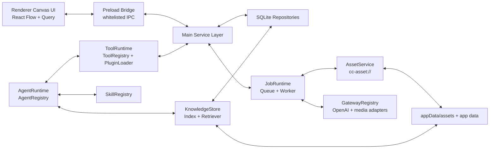

# Design Document - Core Platform Foundation

> Source of truth: `requirements.md` in this directory. This document maps R1-R10 and INV-1-INV-7 into module boundaries and contract work. It is a foundation design, not an implementation patch.

## Overview

ComicCanvas Studio needs one platform spine before feature work scales: the canvas, local jobs, assets, gateway providers, tools, plugins, agents, skills, and knowledge retrieval all meet at shared contracts. The design uses a local-first Electron main process as the service boundary, a sandboxed renderer as the canvas UI, SQLite-backed repositories for durable state, and registries for provider/tool/agent/skill extensibility.

The key architectural choices are:

- Slow work is always a durable job. IPC handlers return tickets only. This satisfies R2, R3, and INV-1/INV-2.
- Local files and generated media are accessed by logical IDs and safe protocols, never absolute paths. This satisfies R4 and INV-5.
- Provider quirks stop at Gateway adapters. Canvas, jobs, tools, and agents consume normalized envelopes. This satisfies R5 and INV-3.
- Tools, plugin tools, skills, and sub-agents all pass through permissioned registries. This satisfies R6-R8 and INV-4/INV-7.
- Context and RAG are explicit scoped services, not implicit model memory. This satisfies R9 and INV-6.

## Architecture



## Component Boundaries

### Shared Contracts

Owned by `shared/`. These are the only type-level contracts allowed to be imported by both main and renderer:

| Contract | Purpose | Required By |
| :--- | :--- | :--- |
| `shared/nodes.ts` | Node, edge, node data, media state | R2, R4 |
| `shared/connection-matrix.ts` | Canvas connection truth | R2 |
| `shared/plan.ts` | CanvasPlan, RunStep, dropped items | R2, R7 |
| `shared/ipc.ts` | IPC channel names and payload schemas | R1, R3, R10 |
| `shared/jobs.ts` | Job ticket, state, terminal event envelope | R3 |
| `shared/assets.ts` | AssetRef, media metadata, folder refs | R4 |
| `shared/gateway.ts` | Provider capabilities and normalized envelopes | R5 |
| `shared/tools.ts` | Tool descriptors and permission metadata | R6 |
| `shared/agents.ts` | Agent descriptors and context policy | R7 |
| `shared/skills.ts` | Skill descriptors and invocation records | R8 |
| `shared/knowledge.ts` | Knowledge document, chunk, retrieval result | R9 |

Implementation tasks must avoid duplicating these shapes in renderer or main-only files.

### IPC And Service Contracts

Every IPC/service surface needs a contract document before code. The foundation requires these documents:

| Contract Doc | Module |
| :--- | :--- |
| `docs/api-contracts/canvas-plan.md` | CanvasPlan apply/run lifecycle |
| `docs/api-contracts/jobs.md` | job enqueue/query/events/recovery |
| `docs/api-contracts/assets-files.md` | asset save/import/folders/protocol |
| `docs/api-contracts/gateway-providers.md` | provider config/capabilities/normalized calls |
| `docs/api-contracts/tools-plugins.md` | ToolRuntime, built-in tools, plugin tool registration |
| `docs/api-contracts/agents.md` | AgentRegistry, agent run, sub-agent spawn |
| `docs/api-contracts/skills.md` | SkillRegistry discovery/invocation/reload |
| `docs/api-contracts/knowledge-context.md` | knowledge ingest/retrieve/delete/context pack |
| `docs/api-contracts/audit-observability.md` | audit entries, traces, health checks |

Existing `docs/api-contracts/tools-agents.md` can either become an overview or be split into the module-specific contracts above. The implementation plan must choose one route before code starts.

### JobRuntime

`desktop/src/main/jobs/` owns durable work. Its public service shape:

```ts
interface JobRuntime {
  enqueue(input: JobCreateInput): Promise<JobTicket>
  getJob(jobId: string): Promise<JobRecord>
  listJobs(filter: JobListFilter): Promise<JobRecord[]>
  recoverOnStartup(): Promise<JobRecoveryReport>
  subscribeTerminal(listener: JobTerminalListener): Unsubscribe
}
```

Finite states: `pending -> processing -> completed | failed | canceled`. `canceled` is reserved until a later milestone exposes cancellation. Foundation implementation may mark cancellation unsupported while keeping the state model forward-compatible.

Recovery policy:

- `pending`: keep pending.
- `processing` with no active worker lease: mark `pending` for retry if retry policy allows; otherwise mark `failed` with `worker_interrupted`.
- terminal states: never rewrite terminal state except idempotent metadata repair.

### AssetService And Local File Library

`desktop/src/main/assets/` owns file safety and reference integrity.

Core APIs:

```ts
interface AssetService {
  saveGeneratedAsset(input: GeneratedAssetInput): Promise<AssetRecord>
  importLocalFile(input: ImportFileInput): Promise<AssetRecord>
  getAsset(assetId: string): Promise<AssetRecord>
  moveAsset(input: MoveAssetInput): Promise<AssetRecord>
  trashAsset(assetId: string): Promise<AssetTombstone>
  resolveAssetUrl(assetId: string): Promise<CcAssetUrl>
}
```

Rules:

- Generated bytes are content-addressed where possible.
- DB stores relative paths from the configured asset root.
- Renderer receives `cc-asset://asset/<assetId>` or another documented logical URL, not filesystem paths.
- Folder moves update folder relations, not raw path references.
- Deletion checks references from graph nodes, jobs, chat messages, and knowledge documents.

### GatewayRegistry

`desktop/src/main/providers/` owns provider normalization. The first adapters are:

- `openai-compatible-text`: chat/responses-style text generation where available through OpenAI-compatible endpoints.
- `openai-compatible-image`: image generation/edit-style protocol where available.
- `async-media-task`: submit/poll/fetch pattern for common image/video providers.
- `stub`: deterministic local adapter for tests and M1/M2 wiring.

Normalized request:

```ts
interface GatewayRequest {
  channel: 'text' | 'image' | 'video'
  modelKey: string
  prompt: string
  references: AssetRef[]
  parameters: Record<string, unknown>
  idempotencyKey: string
}
```

Normalized result:

```ts
type GatewayResult =
  | { kind: 'text'; text: string; usage?: GatewayUsage }
  | { kind: 'assetBytes'; mediaType: 'image' | 'video'; bytes: Uint8Array; metadata: MediaMetadata }
  | { kind: 'remoteTask'; remoteTaskId: string; pollAfterMs: number }
```

Provider-specific fields stay in adapter trace metadata and cannot leak into CanvasPlan or renderer node data.

### ToolRuntime And PluginLoader

`desktop/src/main/tools/` owns all callable capabilities. Built-in tools and plugin tools share this interface:

```ts
interface ToolDefinition<I, O> {
  name: string
  owner: { kind: 'builtin' | 'plugin'; id: string }
  description: string
  inputSchema: Schema<I>
  outputSchema: Schema<O>
  permissions: ToolPermission[]
  concurrency: 'readonly' | 'serial-write' | 'exclusive'
  call(input: I, ctx: ToolUseContext): AsyncGenerator<ToolProgress, O>
}
```

Plugin loading sequence:

1. Read manifest.
2. Validate plugin ID, version, permissions, entrypoint, and declared tools.
3. Load in a restricted runtime boundary defined by the implementation plan.
4. Register tools only after schema and permission validation.
5. On failure, quarantine plugin and expose diagnostics.

The foundation does not require a public plugin marketplace. It requires local plugin extension points and safe registration.

### AgentRuntime And AgentRegistry

`desktop/src/main/agent/` owns built-in and custom agents.

Agent descriptor:

```ts
interface AgentDefinition {
  id: string
  source: 'builtin' | 'user'
  name: string
  instructions: string
  allowedTools: string[] | '*'
  allowedSkills: string[] | '*'
  gatewayPolicy: AgentGatewayPolicy
  contextPolicy: AgentContextPolicy
  permissionPolicy: AgentPermissionPolicy
}
```

Built-in agents:

- `orchestrator-agent`: request analysis and CanvasPlan generation.
- `canvas-agent`: canvas graph and node workflow specialist.
- `tooling-agent`: runtime, DB, jobs, providers, and IPC specialist.
- `pm-agent`: requirements, contracts, backlog, and verification specialist.

Sub-agent permissions are computed by intersection of parent policy, target agent policy, and user/session policy.

### SkillRegistry

`desktop/src/main/skills/` or an equivalent main-process module owns app-visible skills. Repository-level Codex skills in `.agents/skills/` can be used as development-time guidance, but product runtime skills need their own persisted/discoverable contract.

Skill descriptor:

```ts
interface SkillDefinition {
  id: string
  source: 'builtin' | 'user' | 'plugin'
  version: string
  description: string
  entry: string
  references: SkillReference[]
  requiredTools: string[]
  requiredPermissions: ToolPermission[]
}
```

The registry exposes metadata first and loads heavy references only when invoked. This keeps context budget predictable.

### KnowledgeStore And ContextBuilder

`desktop/src/main/knowledge/` owns project-scoped retrieval and context assembly.

Knowledge APIs:

```ts
interface KnowledgeStore {
  ingest(input: KnowledgeIngestInput): Promise<KnowledgeDocument>
  retrieve(query: KnowledgeQuery): Promise<KnowledgeChunk[]>
  deleteDocument(documentId: string): Promise<void>
  rebuildIndex(scope: KnowledgeScope): Promise<KnowledgeIndexReport>
}

interface ContextBuilder {
  build(input: ContextBuildInput): Promise<ContextPack>
}
```

RAG support is required because the core product depends on local files, project records, generated assets, and reusable knowledge. Retrieval must be explicit, scoped, citable, and deletable. The first implementation can use lexical retrieval or embeddings behind an interface, but the contract must support both.

Context priority:

1. System/developer policy and selected agent instructions.
2. Current user request.
3. Active canvas selection and graph summary.
4. Selected files/assets and explicit references.
5. Retrieved knowledge chunks with source metadata.
6. Recent messages.
7. Summaries/memories after redaction.

## Data Models

| Table | Key Fields | Notes |
| :--- | :--- | :--- |
| `jobs` | `id, type, status, payload_json, result_json, error_class, lease_owner, attempts, created_at, updated_at` | Durable queue and terminal state |
| `assets` | `id, rel_path, media_type, width, height, duration_ms, orientation, hash, status` | Generated/imported media |
| `asset_folders` | `id, parent_id, name, sort_order, deleted_at` | Local library hierarchy |
| `asset_references` | `asset_id, ref_type, ref_id` | Integrity checks before deletion |
| `gateway_configs` | `id, type, base_url, auth_ref, capability_json, model_map_json, enabled` | Secrets stored outside plaintext config |
| `tools` | `id, owner_kind, owner_id, name, schema_json, permission_json, enabled` | Registry snapshot |
| `tool_audit` | `id, tool_id, actor_type, actor_id, decision, target_json, created_at` | Permission and trace evidence |
| `agents` | `id, source, name, instructions, policy_json, enabled` | Built-in mirrored or user-defined |
| `agent_runs` | `id, agent_id, status, context_pack_ref, trace_json, error_class` | Debug and replay metadata |
| `skills` | `id, source, version, entry, metadata_json, enabled` | Runtime skills |
| `skill_invocations` | `id, skill_id, version, agent_run_id, loaded_refs_json` | Reproducibility |
| `knowledge_documents` | `id, source_type, source_ref, scope_json, status, deleted_at` | Ingested docs/files/assets |
| `knowledge_chunks` | `id, document_id, ordinal, text, metadata_json, embedding_ref` | Retrieval units |
| `context_packs` | `id, agent_run_id, summary_json, source_refs_json` | Bounded context trace |

## API And IPC Surface

Channel names should use `domain.action` and schemas from `shared/ipc.ts`.

| Domain | Required Calls | Required Events |
| :--- | :--- | :--- |
| `job` | `job.enqueue`, `job.get`, `job.list` | `job.completed`, `job.failed`, `job.progress` |
| `asset` | `asset.import`, `asset.get`, `asset.list`, `asset.move`, `asset.trash` | `asset.changed` |
| `gateway` | `gateway.list`, `gateway.save`, `gateway.test`, `gateway.reload` | `gateway.changed` |
| `tool` | `tool.list`, `tool.invoke`, `tool.enable`, `tool.disable` | `tool.progress`, `tool.audit` |
| `agent` | `agent.list`, `agent.save`, `agent.run`, `agent.getRun`, `agent.spawn` | `agent.progress`, `agent.completed`, `agent.failed` |
| `skill` | `skill.list`, `skill.reload`, `skill.getMetadata` | `skill.changed` |
| `knowledge` | `knowledge.ingest`, `knowledge.retrieve`, `knowledge.delete`, `knowledge.rebuild` | `knowledge.indexed`, `knowledge.failed` |
| `canvas` | `canvas.getGraph`, `canvas.saveGraph`, `canvas.applyPlan`, `canvas.runNode` | `canvas.graphChanged`, `canvas.planReady` |

Implementation may split or rename calls only if the contract docs are updated first.

## Security And Recovery

Security defaults:

- Renderer sandbox remains on.
- Preload exposes typed wrappers only.
- Plugin tools cannot bypass ToolRuntime.
- Provider secrets are referenced by secret IDs, not stored in normal JSON.
- Logs and LTM exclude secrets, hidden prompts, raw auth headers, and absolute paths.

Recovery surfaces:

- `job.recoverOnStartup` report.
- `asset.verifyLibrary` for missing files and orphan DB rows.
- `gateway.healthCheck` for enabled providers.
- `plugin.quarantine` for invalid plugin tools.
- `skill.reload` with previous-valid-version fallback.
- `knowledge.rebuildIndex` for stale or deleted documents.

## Testing Strategy

| Invariant | Test Level | Approach |
| :--- | :--- | :--- |
| INV-1 | IPC/service integration | Deep-scan sync responses for bytes, URLs, paths |
| INV-2 | JobRuntime unit/integration | State-machine tests and duplicate terminal event injection |
| INV-3 | Gateway unit | Golden provider payloads normalize to stable envelopes |
| INV-4 | Agent/tool/skill unit | Permission intersection property tests |
| INV-5 | Asset integration | Referenced asset delete/move/trash cases |
| INV-6 | Knowledge integration | Scope/deletion retrieval tests |
| INV-7 | Registry unit | Failed reload keeps previous valid snapshot |

Additional checks:

- Static scan for renderer imports of Node/main-process modules.
- Static scan for `setInterval`/polling in generation state.
- Contract tests that compare `shared/` schemas with IPC handlers.
- Redaction tests for logs, traces, LTM capture, and debug export.

## Migration And Cutover

| Phase | Work | Exit Criteria |
| :--- | :--- | :--- |
| M0-A | Move specs to root `specs/`; register global backlog | Backlog links root specs and no new spec points to tool-specific spec directories |
| M0-B | Split API contract docs | Required `docs/api-contracts/*.md` files exist with owners |
| M0-C | Define shared contracts | `shared/*` contracts compile and have schema tests |
| M1 | DB + JobRuntime + stub Gateway + AssetService skeleton | Manual text/image stub generation returns ticket and terminal event |
| M2 | Canvas node lifecycle + local file library basics | Nodes bind assets through safe protocol |
| M3 | OpenAI-compatible and async media gateway adapters | Provider config hot reload and normalized results pass tests |
| M4 | ToolRuntime + AgentRuntime + CanvasPlan path | Built-in orchestrator can produce sanitized Plan |
| M5 | Plugin tools + custom agents/skills + KnowledgeStore/RAG | Scoped retrieval and permissioned plugin tools work in integration tests |

The existing `.claude/` directory may remain as a compatibility/archive layer, but new project specs are created under root `specs/`.
