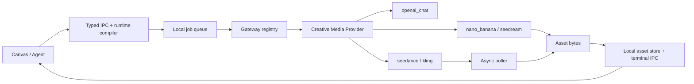

# Design - Creative Media Gateway

> Source of truth: `requirements.md` in this directory.

## Overview

`creative_media` is a system-built-in provider, not a NewAPI template. It
translates normalized ComicCanvas text, image, and video requests into a small
set of owned protocol profiles. The renderer configures base URL, vault-backed
key reference, and model routes. Nodes and Agents select a model key only; they
cannot select paths, payload fields, or adapters.

## Architecture



## Components And Interfaces

### Shared Contracts

`shared/gateway.ts` adds `creative_media` and route records:

```ts
type CreativeMediaProfile =
  | 'openai_chat'
  | 'nano_banana'
  | 'seedream'
  | 'seedance'
  | 'kling'

interface GatewayModelRoute {
  channel: GatewayChannel
  modelKey: string
  profile: CreativeMediaProfile
}
```

`GatewayConfigInput` and `GatewayConfigView` gain `modelRoutes`. The existing
single-value `modelMap` remains a compatibility projection while catalog and
configuration consumers migrate. Profile validation is exhaustive and profile
names never enter a CanvasPlan.

### Provider Core

`createCreativeMediaProvider` implements the existing `GatewayProvider`
interface. It resolves `(request.channel, request.modelKey)` to one route,
delegates to the matching adapter, and owns authorization, redaction,
cancellation, normalized errors, and result normalization. `gateway-reloader`
instantiates it only for `creative_media`; current provider types remain intact.

### Text Profile

`openai_chat` uses `POST /v1/chat/completions`, normalized messages and tools,
allowlisted `temperature`/token controls, and existing SSE parsing. Streaming is
disabled for native tool calls so the provider returns a complete valid tool-call
envelope.

### Image Profiles

| Profile | Mapping |
| :--- | :--- |
| `nano_banana` | Emits one output, normalized size, and `images` only for references. It may append a size hint when the protocol ignores its size field. |
| `seedream` | Emits profile-defined size or resolution, URL response format, and only the reference-image shape it accepts. It never inherits Nano Banana quality/output fields. |

Adapters accept only prompt, normalized size/resolution, and image references.
Every other parameter is explicitly allowlisted or dropped. URL and base64 image
responses normalize to `GatewayResult.assetBytes`.

### Video Profiles

| Profile | Submit mapping | Task mapping |
| :--- | :--- | :--- |
| `seedance` | Prompt plus metadata content for image/video/frame references; strict duration, ratio, and resolution fields. | Seedance submit/status/result parsers. |
| `kling` | Text-to-video or image-to-video based on normalized references; first image, optional tail image, duration, and aspect ratio. | Kling status vocabulary and video URL parser. |

Endpoint paths are profile constants. Settings cannot accept raw paths or JSON
payload overrides. Both profiles use the existing worker-side polling primitives
with backoff, cancellation, progress, timeout, result download, and local asset
writeback.

### Settings And Catalog

Gateway settings seed one disabled `Creative Media Gateway`. Its dedicated form
mode manages channel-grouped route rows and only channel-valid profile choices.
It may fetch `/models` where available, while permitting manual media model
routes for models omitted by that endpoint. `buildModelCatalog` emits every
enabled route, allowing one gateway to offer several image and video models.

## Data Models

| Contract | Change | Notes |
| :--- | :--- | :--- |
| `GatewayType` | Add `creative_media` | System-built-in custom gateway. |
| `GatewayModelRoute` | New shared record | Channel, model key, validated profile. |
| Config input/view | Add `modelRoutes` | Never contains a secret. |
| `GatewayModelMap` | Retain temporarily | Derived default per channel. |
| `GatewayRequest` | Unchanged | Only request crossing runtime/provider boundary. |

## IPC And Errors

Existing `gateway.save`, `gateway.list`, `gateway.models`, and `gateway.reload`
channels remain. Their contracts gain model routes before handler changes;
`docs/api-contracts/gateway-providers.md` changes in the same implementation
step. Errors map to the current shared classes: invalid route is
`capability_unsupported`, malformed responses are `provider_payload_invalid`,
remote failures are `provider_request_failed`, timeout is `provider_timeout`,
and cancellation is `provider_canceled`.

## Correctness Properties

- **INV-1:** An exhaustive profile-to-channel map validates every route.
- **INV-2:** Views, catalog, IPC, and Agent prompts contain neither credentials
  nor authorization headers.
- **INV-3:** Provider bodies derive only from normalized inputs, route profile,
  and allowlisted parameters.
- **INV-4:** Video polling occurs only in the main-process job lifecycle; the
  renderer receives normal local tickets and terminal events.

## Testing Strategy

| Area | Test level | Evidence |
| :--- | :--- | :--- |
| Route validation/catalog | Unit | Valid/invalid matrix and multi-route catalog. |
| Text profile | Unit | Chat, SSE, tools, and redaction. |
| Image profiles | Unit | Exact body, references, defaults, URL/base64 response. |
| Video profiles | Unit | Submit, progress, success, failure, timeout, cancellation. |
| Reload/settings | Integration | Future calls reload; in-flight call retains handle. |
| Canvas/jobs | Integration | Async enqueue and terminal local asset writeback. |

## Migration And Cutover

| Phase | Work | Reversible |
| :--- | :--- | :--- |
| 1 | Contracts, docs, and validation. | Yes. |
| 2 | Isolated provider plus unit tests; config remains disabled. | Yes. |
| 3 | Settings, catalog, and reload wiring. | Yes; disable gateway. |
| 4 | Configured text/image/video smoke tests. | Yes; disable or delete gateway. |

A future `newapi` template requires its own specification and does not inherit
these private protocol profiles.
