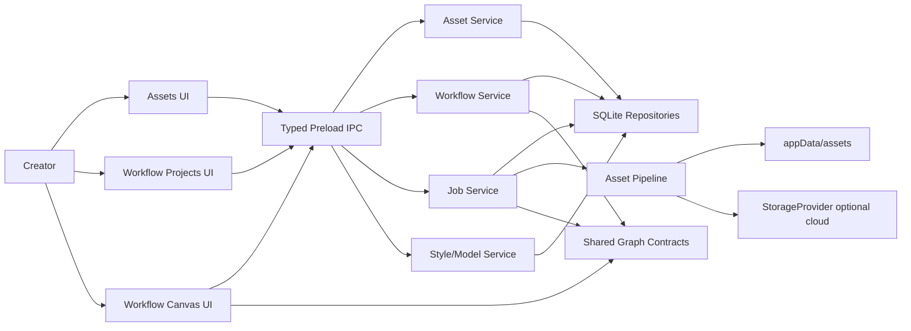

# Design - hjwall Assets + Workflows 100% Migration

## Overview

This migration is product-first. Assets and workflows become complete manual
creator surfaces before Agent orchestration is expanded. The implementation
keeps ComicCanvas architecture:

- Electron renderer and typed preload IPC.
- SQLite repositories and local appData assets.
- StorageProvider abstraction for optional cloud media.
- In-process durable jobs, terminal IPC events, and one-shot reconciliation.
- Shared contracts under `shared/` as the only graph truth.

hjwall is a reference for capability shape and UI behavior. ComicCanvas remains
the source of implementation.

## Architecture

## Reference Modules

| Area | hjwall Reference | ComicCanvas Current Owner |
| :--- | :--- | :--- |
| Asset page UI | `pc-client/src/modules/asset/views/AssetPage.tsx` | `desktop/src/renderer/src/assets/*` |
| Asset cards/filter/preview | `pc-client/src/modules/asset/components/*` | `AssetPanel`, new components |
| Image categories | `asset/components/Character*`, asset category-like UI from hjwall | asset category UI + repo extensions |
| Asset backend | `backend/src/modules/asset/*` | `asset.repo`, `asset.handler`, asset pipeline |
| Workflow projects | `WorkflowProjectsPage.tsx` | `ProjectsListPage.tsx` |
| Canvas shell | `WorkflowCanvasPage.tsx` | `CanvasPage.tsx` |
| Canvas nodes | `workflow-canvas/nodes/*` | `canvas/nodes/*`, `shared/nodes.ts` |
| Canvas panels | `workflow-canvas/components/*Panel*` | `canvas/components/*` |
| Graph validation | `workflow-graph-validator`, `connectRules` | `shared/connection-matrix`, graph sanitizer |
| Runtime jobs | workflow generation services | `jobs/worker`, `canvas.handler`, providers |
| Templates/snippets | `workflow-template`, `workflow-snippet` | `canvas-snippet.repo`, workflow repo extensions |

## Current ComicCanvas Assessment

### Already Useful

- `shared/nodes.ts` contains most migrated node types.
- `shared/connection-matrix.ts` contains a broad migrated matrix.
- `AssetPanel` already has folders, search, media filter, sort, grid/list,
  preview, move, trash, and folder deletion.
- Workflow repo supports create, graph versions, list, rename, delete.
- Canvas has partial toolbar, command palette, connect-to-create, snippets,
  style selector, asset panel, chat box, job panel, local media drop, and
  one-shot job reconciliation.
- Style presets, StorageProvider, cloud upload, and job terminal fanout exist.

### Major Gaps

- UI parity is incomplete and fragmented; some comments in `CanvasPage.tsx` are
  mojibake and should be cleaned while touching the file.
- hjwall assets are semantic and character-aware; ComicCanvas will adapt those
  concepts into generic image assets with custom categories/tags.
- hjwall workflow projects include public templates, cover cards, run status,
  copy/import flows, and project default style in one cohesive surface.
- Many production nodes are represented by a generic `MigratedNode`, not real
  hjwall-equivalent node components.
- Edge types in ComicCanvas are narrower: `promptOrder`, `imageRole`, `default`.
  hjwall also models `imageOrder`, `outputLink`, and `reference`.
- Runtime services need parity for polish recovery, generation task recovery,
  URL refresh/re-signing, run history, node definitions, graph compiler, and
  strict vs lenient validation.

## Data Model Direction

### Asset Records

Extend current `assets`, `asset_folders`, and `asset_references` with image
category/tag metadata rather than copying hjwall role/scene/prop/creature tables
directly.

Required fields or derived views:

- media: type, mime, hash, size, dimensions, orientation, duration.
- ownership: local user/project/workflow relation where needed.
- category/tag metadata: built-in starter categories for role, scene, prop,
  creature, plus arbitrary user categories.
- image category assignment: one image may belong to multiple categories/tags.
- reference integrity: workflow node, workflow job, style, category, and snippet
  references.

### Workflow Records

Extend current workflow persistence:

- workflow project summary: cover, edge count, latest run status, default style,
  deleted/archived status.
- immutable graph versions with checksum.
- warnings from draft validation.
- public/private template metadata.
- snippet templates with fragment, owner scope, thumbnail/metadata.
- workflow run and workflow run node records for history.

### Graph Contracts

The production graph contract must include:

- node types: text, image, video, character, scene, audio, imageConfig,
  imageConfigV2, videoConfig, videoConfigV2, videoCompose, superResolution,
  muxAudioVideo, mjImage.
- `mjImage` is retained only for legacy graph compatibility in local Phase A;
  MJ node/component implementation, run recovery, and URL refresh are out of
  scope.
- edge types: promptOrder, imageOrder, imageRole, outputLink, reference.
- image roles: first frame, last frame, input/reference.
- graph warnings: dropped node, dropped edge, stale model, stale asset, stale
  style, unsupported node, unavailable runtime.

## UI Design Direction

Use hjwall's Studio Mono visual behavior as product reference, but keep current
ComicCanvas design tokens. The UI must be dense and tool-like rather than a
marketing page.

Asset page:

- top type tabs with counts and URL sync.
- upload card/progress state.
- filter bar for search/date/sort.
- asset grid/list cards.
- preview modal.
- category management flow for creating/editing/deleting image categories.
- categorized image picker flow for inserting images as image, character, scene,
  or reference nodes depending on canvas context.

Workflow project page:

- tabs: my projects, public templates.
- cards with cover, counts, run status, delete/copy.
- import JSON, create project, copy template.
- empty/error/loading states.

Canvas:

- top bar with project name, save/import/export/back, default style, dirty state.
- left toolbar and plus menu.
- context menu and connect-to-create menu.
- panels for asset library, character library, style library, workflow/snippets,
  chat, run/job history.
- node components built as production controls, not placeholder cards.

## IPC/API Contract Direction

Existing channels should be expanded rather than inventing raw ad hoc channels.

Required domains:

- `asset.*`: list/import/upload/rename/delete/preview/folders/move/trash,
  category list/create/update/delete/reorder, asset-category assignment, tags,
  and reference-safe deletion.
- `canvas.*` or `workflow.*`: project list/create/update/delete/detail,
  save/load/version list, import/export/copy template, validate.
- `canvasSnippet.*`: list/detail/save/delete/insert metadata.
- `job.*`: run tickets, terminal events, run history, task status recovery.
- `style.*`: list/project default/node override resolution.

Every new channel must be registered in `shared/ipc.ts` and documented under
`docs/api-contracts/`.

## Tool-First Canvas Capability Layer

Current ComicCanvas has these MVP canvas tools in
`desktop/src/main/tools/canvas/index.ts`:

- `canvas.queryGraph`
- `canvas.proposePlan`
- `canvas.createNode`
- `canvas.connectNodes`
- `canvas.updateNodeData`
- `canvas.deleteNode`
- `canvas.runNode`

The migration must expand this into a tool/service surface that covers every
durable manual canvas action needed by future Agent orchestration:

| Tool Group | Required Capability |
| :--- | :--- |
| `canvas.graph.*` | query graph, validate graph, save/load graph, list versions, restore version, export/import graph JSON. |
| `canvas.node.*` | create node, duplicate node, delete node, rename node, update data, set position, batch move, batch delete. |
| `canvas.edge.*` | connect, disconnect, update edge role/order, reject duplicate/invalid edges, connect-to-create. |
| `canvas.selection.*` | set/clear selection, duplicate selection, delete selection, extract selected fragment for snippets. |
| `canvas.layout.*` | fit view intent, auto layout, layered layout, normalize inserted fragment positions. |
| `canvas.snippet.*` | list snippets, get detail, save selected graph, insert snippet, delete owned snippet. |
| `asset.*` | import/list/get asset, create/update/delete category, assign category, move/trash, reference-safe delete checks. |
| `workflow.*` | list/create/update/delete project, import/export project JSON, copy template, list templates. |
| `style.*` | list styles, set project default, resolve effective node style, validate stale or disabled style. |
| `job.*` | run node, run plan step, return ticket, list/recover terminal jobs, map result payloads to node patches. |
| `media.*` | crop/rotate/apply image edit, classify local drops, create graph nodes from dropped media assets. |

Design rules:

- Tools own schema validation, shared graph validation, permission descriptors,
  and structured error codes.
- Renderer UI may keep transient interaction state such as hover, drag preview,
  menus, and viewport animation, but durable graph changes must route through
  shared service/tool semantics.
- IPC handlers should remain thin and delegate to the same service functions
  used by tools.
- Provider-spending tools return job tickets, never generated bytes.
- Destructive tools declare `destructive` and explain their reference checks in
  the descriptor.

## Testing Strategy

| Area | Automated Evidence |
| :--- | :--- |
| Inventory | Static test that every hjwall capability maps to a task ID. |
| Asset UI | Component tests for tabs, filters, upload, preview, batch, category flows. |
| Asset repo | Repository tests for metadata, references, safe delete, folders. |
| Workflow projects | Component/IPC tests for create/import/export/copy/delete/template tabs. |
| Graph contracts | Unit/PBT tests for node/edge matrix and serializer warnings. |
| Canvas UI | Component tests for toolbar, menus, shortcuts, panels, drop, selection. |
| Nodes | Component tests per production node type. |
| Tools | ToolRuntime tests for UI-equivalent graph/node/edge/snippet/asset/workflow/job operations and permission descriptors. |
| Runtime | IPC/job tests for ticket-only responses and terminal writeback. |
| Snippets/templates | Repository/UI tests for save/list/detail/delete/insert. |
| Performance | Store selector and large graph rendering tests. |
| Human review | `docs/progress/human-desktop-review-checklist.md` rows for final acceptance. |

## Migration Sequence

1. Inventory and gap audit.
2. Asset module parity.
3. Workflow project/template parity.
4. Canvas shell/interaction parity.
5. Production node parity.
6. Runtime and async parity.
7. Snippets/templates/style/model/feature flags.
8. Tool/UI equivalence hardening.
9. Human review hardening.
10. Agent migration over completed manual flows.
11. Infinite canvas architecture and performance evolution.
