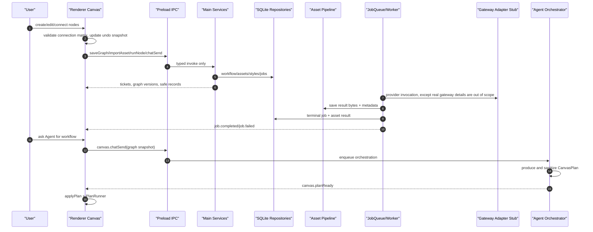

# Design Document - hjwall Canvas Full Migration

> Source of truth: `requirements.md` in this directory.

## Overview

The migration is implemented as a set of vertical product slices rather than a
file-by-file port. hjwall remains a reference for capability shape and edge
cases. ComicCanvas keeps its own architecture: Electron renderer, typed preload
IPC, main-process repositories/services, SQLite persistence, local asset
pipeline, in-process durable jobs, and declarative Agent CanvasPlan.

The design has four layers:

- **Inventory and contracts**: record each accepted hjwall capability, the
  adapted ComicCanvas behavior, API/IPC contract, and test evidence.
- **Canvas user layer**: React Flow canvas, Tailwind/cn UI, interaction
  primitives, nodes, panels, snippets, and desktop flows.
- **Main local service layer**: workflow versions, assets, style presets, jobs,
  prompt composition, graph validation, and runtime dispatch.
- **Agent layer**: natural language to sanitized CanvasPlan, apply/execute,
  and task status recovery.

## Architecture



## Components and Interfaces

### Migration Inventory

Create a living implementation checklist from hjwall modules:

| Capability Area | hjwall Reference | ComicCanvas Owner |
| :--- | :--- | :--- |
| Project list/canvas shell | `pc-client/src/modules/workflow-canvas/views/*` | renderer projects/canvas + workflow repo |
| Canvas interactions | `WorkflowCanvasPage.tsx`, `store.ts`, `lib/*` | renderer canvas + shared contracts |
| Asset library | `pc-client/src/modules/asset/*`, `workflow-canvas/components/AssetLibraryPanel.tsx` | asset repo/IPC/panels |
| Style presets | `backend/src/modules/style/*`, `StyleLibraryPanel.tsx` | new style contract/repo/IPC/UI |
| Async runs | `backend/src/modules/workflow/*generation*`, `useGenerationTasks.ts` | jobs, providers, canvas realtime |
| Agent orchestration | `workflow-chat.service.ts`, `plan-applier.ts`, `plan-runner.ts` | orchestrator, sanitizePlan, renderer PlanRunner |

The inventory becomes the gate for marking each REQ complete. Existing backlog
status is treated as historical until verified against current code and runtime.

### Shared Canvas Contracts

`shared/nodes.ts` and `shared/connection-matrix.ts` must be expanded from the
current narrow set to the accepted production node set. The accepted set should
be explicit:

```ts
type NodeType =
  | 'text'
  | 'image'
  | 'video'
  | 'character'
  | 'scene'
  | 'audio'
  | 'imageConfigV2'
  | 'videoConfigV2'
  | 'videoCompose'
  | 'superResolution'
  | 'muxAudioVideo'
  | 'mjImage'
```

Every node type must have:

- Shared data type.
- UI component.
- Serializer/deserializer support.
- Connection matrix entries.
- Run support or explicit unavailable state.
- Component and contract tests.

### Workflow Project and Versioning

Workflow data stays local:

- `workflows`: identity, display name, timestamps, soft delete, optional
  default style.
- `workflow_versions`: immutable graph snapshots.
- `chat_messages`: Agent history and plan JSON.
- `assets` and `asset_references`: local media records and reference integrity.

`canvas.saveGraph` persists a sanitized graph version. `canvas.loadGraph`
returns the latest version with invalid edges dropped. Import/export is a graph
operation and must reuse the same validation pipeline.

### Canvas Interaction Layer

The renderer should consolidate around one state ownership model. Current code
has a store plus React Flow local state bridge. For production parity, choose
one of these designs per implementation phase:

- React Flow state as immediate UI state and Zustand as committed snapshot
  store, with explicit sync points.
- Zustand as the single graph state source, with React Flow callbacks mapped
  directly into store actions.

Do not mix both without invariants. The selected model must prove undo/redo,
autosave, and realtime terminal updates do not race each other.

Interaction modules:

- Toolbar and command palette.
- Context menu and connect-to-create menu.
- Drop-media import helper.
- Selection action bar and snippet persistence.
- Keyboard shortcut manager.
- Connection feedback banner/toast.
- Project switch dirty-save guard.

### Node System

Primitive and config nodes should be implemented as vertical slices. A node is
not complete until contract, UI, serialization, connection behavior, run
dispatch, asset/status update, and tests exist.

Priority order:

1. Stabilize existing text/image/video/imageConfigV2/videoConfigV2.
2. Add character and scene nodes with structured prompt/reference behavior.
3. Add audio node and audio asset import.
4. Add videoCompose and muxAudioVideo graph/run dispatch with stub jobs.
5. Add superResolution and mjImage only after graph/run tests are in place.

### Style Presets

Style is currently only partially represented in node data. It needs its own
contract:

- `shared/styles.ts`: style preset view/input, prompt parts, enabled state.
- `docs/api-contracts/styles.md`: IPC/service contract.
- `style_presets` table or equivalent repository.
- Main pure function `composeStyledPrompt(content, style)`.
- Renderer style library panel and node/project default selectors.
- Job payload integration: project default unless node override exists.

The style prompt function must be pure and shared or mirrored through one
tested source. Preview and runtime must be byte-equivalent.

### Asset Library

The existing asset folder work is a foundation, but full migration needs the
user flow completed:

- Import image/video/audio/document from local file.
- Store metadata, media type, optional orientation, folder, and safe URL.
- Insert asset into canvas as a node.
- Move/trash/tombstone with reference integrity.
- Trigger `asset.changed` for renderer refresh.
- Show empty, loading, failed, and permission states in UI.

Cloud storage can exist as a configured storage provider, but local-first
behavior remains valid without cloud configuration.

### Async Run State

Every generation-like action uses a local durable job:

- IPC handler validates input and enqueues.
- Job worker composes prompt and references from a graph snapshot.
- Provider adapter returns normalized data or stub data.
- Asset pipeline stores output.
- Terminal job event updates renderer and invalidates relevant queries.
- One-shot reconciliation handles missed events after app reopen.

No renderer polling loop may be introduced for asset status. If a reconciliation
loop is needed for remote async gateways, it belongs in the worker/provider
layer and must be cancellable.

### Agent Orchestration

Agent support must be upgraded as the node vocabulary grows:

- CanvasPlan must know the accepted node/run action set.
- `sanitizePlan` must reject unsupported node types and run actions.
- `applyPlan` must revalidate against the matrix and create one undo snapshot.
- PlanRunner must run migrated generation/config nodes serially.
- Chat UI must surface clarify questions and dropped warnings.

The orchestrator should prefer clarify plans when a comic-drama request lacks
critical information such as target format, character count, or image/video
chain.

## Data Models

| Table/Contract | Fields | Notes |
| :--- | :--- | :--- |
| `workflows` | id, name, timestamps, deletedAt, defaultStylePresetId | Add style default if missing. |
| `workflow_versions` | workflowId, graphJson, createdBy, createdAt | Immutable graph history. |
| `assets` | mediaType, status, relativePath, safeUrl, metadata, folderId, url, s3Key | Renderer sees safe URLs only. |
| `asset_references` | assetId, refType, refId | Required for safe delete/tombstone. |
| `style_presets` | id, name, promptBefore, promptAfter, coverAssetId, enabled, sortOrder | New or adapted local style table. |
| `jobs` | type, status, targetId, payloadJson, resultJson, error | Durable async execution. |
| `chat_messages` | workflowId, role, content, planJson, applyStatus | Agent history. |
| `shared/nodes.ts` | node data unions | Must include migrated node types. |
| `shared/styles.ts` | style preset contracts | New shared truth for style. |

## Correctness Properties

### INV-1: Migration Traceability

The migration inventory must connect reference, requirement, implementation,
and verification evidence for every accepted hjwall capability.

**Validates:** Requirements 1 and 9.

### INV-2: Connection Truth

All edge creation, graph load, graph save, plan sanitize, and plan apply paths
must consume the same connection truth or a generated derivative of it.

**Validates:** Requirements 2, 3, 4, and 8.

### INV-3: Prompt Determinism

Prompt preview and job payload construction must be byte-equivalent for text,
character, scene, style, and reference contributions.

**Validates:** Requirements 4, 5, and 7.

### INV-4: Async-Only Generation

All generation-like work returns tickets synchronously and terminal state via
job records/events.

**Validates:** Requirements 4 and 7.

### INV-5: Asset Safety

Renderer-visible asset paths must be safe protocol or normalized cloud URLs,
and persisted local paths must be relative.

**Validates:** Requirement 6.

### INV-6: User-Flow Completeness

A feature reaches engineering-complete when implementation review and current
automated tests pass. Final product acceptance additionally requires a human
desktop review proving the user can perform the intended flow.

**Validates:** Requirement 9.

## Testing Strategy

| Area | Test Level | Approach |
| :--- | :--- | :--- |
| Inventory | Static/doc test | Verify every accepted capability has REQ, owner, and evidence fields. |
| Contracts | Unit/PBT | Enumerate node types, edge pairs, prompt composition, style injection, sanitizePlan. |
| Canvas UI | Component | Node states, panels, menus, shortcuts, drag/drop, snippets, validation feedback. |
| Persistence | Integration | Save/load/import/export graph with invalid edge dropping and version recovery. |
| Assets | Unit/integration/UI | Import, classify, folder move, tombstone, insert-to-canvas, safe URL rendering. |
| Jobs | Unit/integration | Enqueue-only responses, terminal exactly-once events, one-shot reconciliation. |
| Agent | Unit/integration | NL to sanitized plan, applyPlan one undo snapshot, PlanRunner serial execution. |
| Desktop | Human review | A human reviewer launches Electron, creates a workflow, adds/connects nodes, imports an asset, selects style, applies an Agent plan, and saves/reopens according to the review checklist. |

## Migration And Cutover

| Phase | Work | Reversible |
| :--- | :--- | :--- |
| P0 | Create inventory and mark current claims as unverified until evidence exists. | Yes |
| P1 | Stabilize existing canvas startup and prepare human desktop review checklists for M2-M5 flows. | Yes |
| P2 | Expand shared node/edge contracts for accepted hjwall node set. | Partly |
| P3 | Implement style preset contract/repo/IPC/UI/prompt integration. | Yes |
| P4 | Complete asset drag/drop/import/insert and reference integrity flows. | Yes |
| P5 | Add semantic nodes and composition/enhancement vertical slices. | Partly |
| P6 | Upgrade Agent plan vocabulary and end-to-end human desktop review suite. | Yes |
