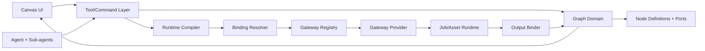

# Design - Infinite Canvas + Agent + Gateway Binding Architecture

## Overview

ComicCanvas should converge on a layered architecture:

1. **Canvas UI Layer**: React Flow interactions, menus, panels, drag/drop,
   viewport animation, transient hover/selection presentation.
2. **Tool/Command Layer**: durable operations exposed as tools/services for
   both UI and Agents.
3. **Graph Domain Layer**: node definitions, ports, edge validation, graph
   versions, snippets, layout, warnings.
4. **Agent Planning Layer**: Context Pack, CanvasPlan, sub-agent execution,
   tool calls, plan apply/run.
5. **Node Runtime Compiler**: compile node/action + graph inputs into normalized
   `NodeRunRequest`.
6. **Gateway Binding Layer**: map normalized requests to provider payloads and
   normalize results.
7. **Job/Asset Layer**: durable jobs, provider execution, asset persistence,
   terminal writeback, output binding.

The current system already has pieces of each layer. The main missing layer is
the explicit **Node Definition + Port + Runtime Binding protocol** between graph
domain and gateway providers.

## Target Architecture



## Current Fit Assessment

| Area | Current Fit | Required Direction |
| :--- | :--- | :--- |
| Manual canvas | Good MVP foundation. | Complete hjwall parity and tool/service backing. |
| Infinite canvas | Partial. React Flow and visible-only rendering exist. | Add graph patching, spatial/layout services, large graph gates. |
| Agent plan | Good MVP skeleton. | Add Context Pack, model-backed planner, tool loop, child merge path. |
| Tools | MVP exists. | Expand to graph/node/edge/layout/selection/asset/workflow/job/media. |
| Gateway | Good first abstraction. | Add dynamic binding manifests and node I/O protocol. |
| Node model | Static TypeScript union. | Add Node Definition registry and typed ports. |
| Runtime | `buildRunDescriptor` is node-type hard-coded. | Replace with Runtime Compiler + bindings. |

## Node Definition Registry

Each built-in or plugin node type should register a definition:

```ts
interface NodeDefinition<TData = Record<string, unknown>> {
  type: string
  version: number
  title: string
  category: 'text' | 'image' | 'video' | 'audio' | 'compose' | 'utility' | 'custom'
  dataSchemaRef: string
  uiSchemaRef?: string
  defaultData: TData
  inputPorts: NodeInputPort[]
  outputPorts: NodeOutputPort[]
  runtimeActions: NodeRuntimeAction[]
  migration?: NodeDataMigration[]
}
```

The initial registry should mirror current `shared/nodes.ts`:

- `text`
- `image`
- `video`
- `character`
- `scene`
- `audio`
- `imageConfigV2`
- `videoConfigV2`
- `videoCompose`
- `superResolution`
- `muxAudioVideo`
- `mjImage`

Eventually, node components should consume Node Definition metadata for default
data, model controls, port labels, and parameter editors.

## Port Model

```ts
type PortMediaType = 'text' | 'image' | 'video' | 'audio' | 'json' | 'asset'

type PortRole =
  | 'prompt'
  | 'negativePrompt'
  | 'reference'
  | 'style'
  | 'firstFrame'
  | 'lastFrame'
  | 'mask'
  | 'audioTrack'
  | 'videoTrack'
  | 'metadata'
  | 'result'

interface NodeInputPort {
  id: string
  label: string
  mediaType: PortMediaType
  role: PortRole
  required: boolean
  multiple: boolean
  ordered: boolean
  accepts: Array<{ nodeType?: string; outputPortId?: string; mediaType: PortMediaType }>
}

interface NodeOutputPort {
  id: string
  label: string
  mediaType: PortMediaType
  role: PortRole
  multiple: boolean
  assetBinding?: {
    dataPath: string
    mediaType: 'image' | 'video' | 'audio'
  }
}
```

Edge data should evolve from:

```ts
interface CanvasEdgeData {
  edgeType: EdgeType
  imageRole?: ImageRole
  createdAt: number
}
```

to:

```ts
interface CanvasEdgeData {
  edgeType: EdgeType
  sourcePortId?: string
  targetPortId?: string
  role?: PortRole
  order?: number
  imageRole?: ImageRole
  createdAt: number
  createdByMention?: boolean
}
```

Compatibility:

- legacy `promptOrder` maps to source `text.result` or `*.prompt/result` and
  target `prompt`.
- legacy `imageRole:first_frame` maps to target `firstFrame`.
- legacy `imageRole:last_frame` maps to target `lastFrame`.
- legacy `default` maps through first compatible default ports.

## Runtime Actions

```ts
interface NodeRuntimeAction {
  id: string
  label: string
  kind: 'text' | 'image' | 'video' | 'audio' | 'compose' | 'upscale' | 'mux' | 'custom'
  requiredCapabilities: GatewayCapabilityRequirement[]
  inputMapping: RuntimeInputMapping[]
  parameterMapping: RuntimeParameterMapping[]
  outputMapping: RuntimeOutputMapping[]
}
```

Example:

```ts
const imageRunAction: NodeRuntimeAction = {
  id: 'imageRun',
  label: 'Generate Image',
  kind: 'image',
  requiredCapabilities: [{ channel: 'image', accepts: ['text', 'image'], produces: ['image'] }],
  inputMapping: [
    { from: 'port:prompt', to: 'request.prompt', combine: 'appendOrdered' },
    { from: 'port:reference', to: 'request.references', role: 'reference' }
  ],
  parameterMapping: [
    { from: 'data.modelId', to: 'request.modelKey' },
    { from: 'data.ratio', to: 'request.parameters.ratio' },
    { from: 'effectiveStyle.negativePrompt', to: 'request.parameters.negativePrompt' }
  ],
  outputMapping: [
    { from: 'result.asset', to: 'data.assetId', outputPortId: 'image' },
    { from: 'result.safeUrl', to: 'data.url' }
  ]
}
```

## Normalized Node Run Request

Runtime Compiler output:

```ts
interface NodeRunRequest {
  workflowId: string
  graphVersion?: string
  nodeId: string
  nodeType: string
  actionId: string
  channel: 'text' | 'image' | 'video' | 'audio' | 'custom'
  gatewayId?: string
  modelKey?: string
  prompt?: string
  inputs: RuntimeInputRef[]
  references: GatewayReference[]
  parameters: Record<string, unknown>
  outputBindings: RuntimeOutputBinding[]
  compileSnapshot: {
    nodeDataHash: string
    inputEdgeIds: string[]
    assetIds: string[]
    stylePresetId?: string
  }
}
```

This replaces direct job payload assembly in `buildRunDescriptor` over time.

## Gateway Adapter Manifest

Gateway config currently stores provider type, URL, capabilities, and model map.
Custom gateway binding needs a manifest:

```ts
interface GatewayAdapterManifest {
  gatewayType: string
  version: number
  displayName: string
  authModes: Array<'none' | 'apiKey' | 'existingRef'>
  capabilities: GatewayCapabilityDescriptor[]
  models: GatewayModelDescriptor[]
  parameterSchemaRef?: string
  inputAccepts: GatewayInputDescriptor[]
  outputProduces: GatewayOutputDescriptor[]
  taskMode: 'sync' | 'async'
  requestMappingRef: string
  resultMappingRef: string
}
```

First implementation can keep built-in adapters in TypeScript while adopting
the manifest shape for capability discovery and validation. Later plugin
gateways can provide manifests plus safe mapping functions or declarative JSON
mapping.

## Binding Resolver

Responsibilities:

1. resolve effective gateway/model from workflow default, node override, action
   override, and gateway availability;
2. validate node action requirements against gateway manifest;
3. map `NodeRunRequest` to provider-specific request shape;
4. normalize provider result to `GatewayResult`;
5. pass normalized result to Output Binder.

Resolution order:

1. explicit node action gateway/model override,
2. node data `modelId` or future `gatewayBinding`,
3. workflow default for action kind/channel,
4. first enabled compatible gateway,
5. fail with `capability_unsupported`.

## Output Binder

Output Binder receives job result and runtime output bindings:

```ts
interface RuntimeOutputBinding {
  outputPortId: string
  resultPath: string
  dataPath: string
  assetRefType?: 'node' | 'job'
  multiple?: boolean
}
```

Rules:

- media outputs are persisted through asset pipeline before graph writeback;
- text/json outputs are validated before writing to node data;
- multi-output nodes preserve ordered outputs and selected index;
- downstream ports reference output port metadata;
- writeback is idempotent by job ID.

## Agent Orchestration Over The Same Model

Agent planning should use Node Definitions:

- available node types,
- allowed input/output ports,
- required runtime actions,
- gateway capability availability,
- tool descriptors.

Plan generation remains declarative. Agent should not emit provider payloads.
When it needs node-specific work:

1. Orchestrator builds Context Pack.
2. Agent creates CanvasPlan.
3. Agent/tool layer applies plan through graph tools.
4. Specialized sub-agent may configure node data through tools.
5. PlanRunner runs actions through Runtime Compiler and JobQueue.
6. Output Binder updates graph state.

## Infinite Canvas Data Direction

Minimum graph state:

```ts
interface CanvasGraphSnapshot {
  nodes: CanvasGraphNode[]
  edges: CanvasGraphEdge[]
  viewport: CanvasGraphViewport
  warnings?: GraphWarning[]
}
```

Future scalable direction:

- graph patches for move/update/batch operations;
- spatial index for viewport queries;
- stable node dimensions and measured metadata;
- immutable graph versions plus optional event log;
- snippet insertion with layout normalization;
- lazy asset thumbnail loading.

## Migration Plan From Current Implementation

1. Keep `shared/nodes.ts` as current compile-time compatibility layer.
2. Add `shared/node-definitions.ts` that mirrors current types.
3. Add optional `sourcePortId`/`targetPortId` to edge data.
4. Add Runtime Compiler that initially reproduces `buildRunDescriptor`.
5. Route `canvas.runNode` through Runtime Compiler behind a feature flag or
   focused vertical slice.
6. Add Binding Resolver over existing `GatewayRegistry`.
7. Gradually move hard-coded node payload logic into runtime actions.
8. Add UI schema-driven parameter controls for gateway-specific settings.

## Testing Strategy

| Area | Tests |
| :--- | :--- |
| Node definitions | All current node types have definitions, schemas, default data, ports, actions. |
| Ports | Valid/invalid port compatibility and legacy edge inference. |
| Runtime compiler | Existing image/video/audio/compose/upscale/mux/MJ jobs compile equivalently. |
| Gateway binding | Capability mismatch fails before remote submission. |
| Output binding | Media/text/json results write back to correct node data and output ports. |
| Tool/UI equivalence | Manual and Agent operations share services. |
| Agent | Plan uses Node Definition vocabulary and never provider payloads. |
| Infinite canvas | Large graph pan/zoom/selection/save/load/layout gates. |
| Migration | Pre-port graph loads with inferred ports or warnings. |

## Acceptance Gates

1. Manual graph creation/link/run works through tools/services.
2. Context-aware Agent can create and run a small workflow.
3. Runtime Compiler replaces `buildRunDescriptor` for at least image/video.
4. One custom gateway manifest can be registered and validated.
5. One node action maps through the dynamic binding layer end-to-end.
6. Large graph smoke test meets interaction and persistence thresholds.
