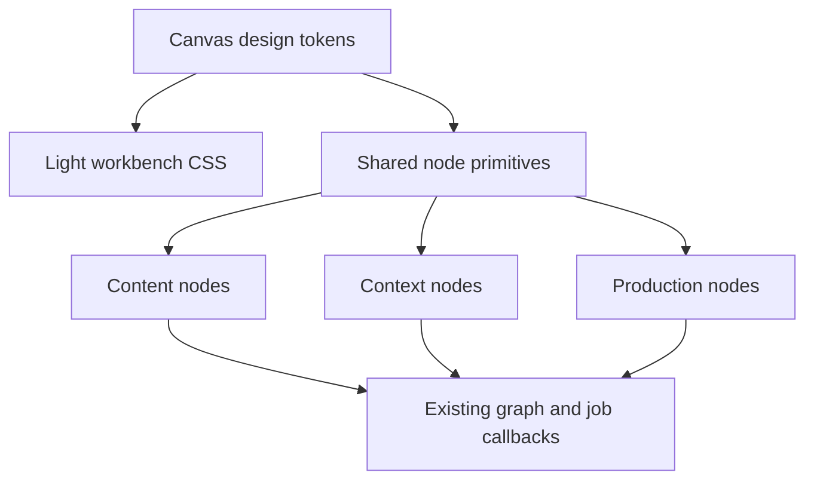

# Design - Light Canvas Node Redesign

> Source of truth: `requirements.md` in this directory.

## Overview

The redesign introduces a light production workbench and shared node visual
primitives. It is limited to renderer markup, styles, accessibility labels, and
presentational composition; existing node data and callbacks remain unchanged.

## Architecture

## Components

### Workbench Tokens

`canvas.css` defines light background, grid, selection outline, compact
controls, and minimap styling. Stable variables describe surface, border, text,
hover elevation, and selection. CSS hover selectors replace JavaScript hover
bookkeeping whenever possible.

### Shared Node Primitives

A renderer-local module supplies compositional frame, header, actions, status,
and handle contracts. The frame is white with 8px corners and a one-pixel
border; hover adds a small shadow and selection uses an outline rather than a
width-changing border. Headers use a 13px title and 11px metadata. Actions are
icon-only, accessible, and visible on hover or selection.

### Migration Families

Content nodes: text, image, video, image generation, video generation.
Context nodes: character, scene, audio. Production nodes: compose,
super-resolution, mux, and MJ. Media previews remain dominant; nested card
surfaces become dividers and compact rows.

## Contract Impact

No shared data, IPC, job, Agent, or connection-matrix contract changes are
required. Existing callback signatures and terminal writeback remain unchanged.

## Testing Strategy

| Area | Evidence |
| :--- | :--- |
| Workbench and frame | Static/component state assertions. |
| Node families | Existing semantic controls and callbacks remain present. |
| Canvas behavior | Drag, zoom, selection, and 2,000-node display regressions stay green. |

## Migration

1. Tokens and primitives with tests.
2. Content and context node migration.
3. Production node and workbench-control migration.
4. Visual screenshot and focused performance verification.
