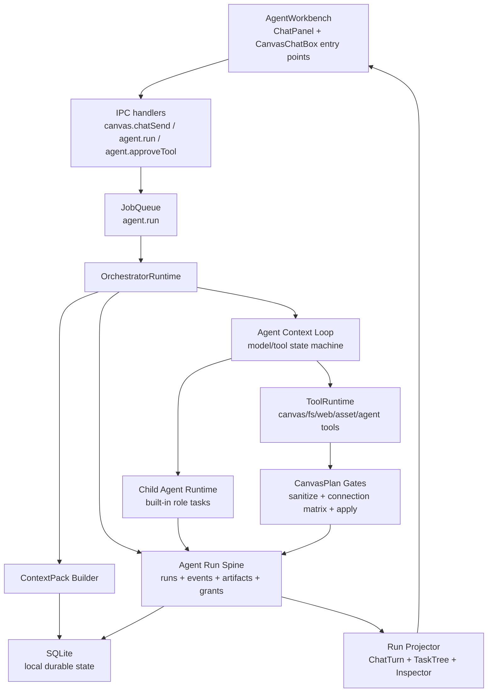
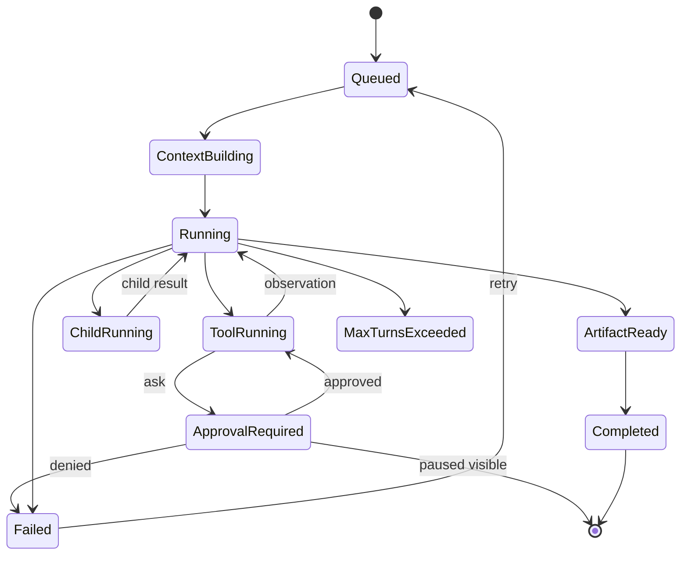

# Design Document - Local Agent Platform

> Source of truth: `requirements.md` in this directory.

## Overview

The Local Agent Platform upgrades ComicCanvas from a canvas chat helper into a local professional Agent workbench. The core design is an Agent Run Spine: a durable, append-only, replayable lifecycle shared by general chat, canvas planning, tool calls, permissions, child-agent tasks, artifacts, errors, and recovery.

This design maps to R1-R9 and INV-1-INV-7. It intentionally excludes enterprise team collaboration, organization roles, cloud sync, and centralized admin policy. "Enterprise-grade" here means local professional reliability: durable state, clear permissions, replay, inspection, typed artifacts, strong tests, and no demo-only silent paths.

Reference principles:

- Codex-style durable guidance, skills, permissions, approvals, sandboxed tool posture, and app workbench concepts.
- Claude/cc-haha-style streaming state machine, context compaction, forked child agents, permission relay concepts, and memory scoping.
- ComicCanvas project constraints: Electron + SQLite + IPC, local assets, in-process durable jobs, shared CanvasPlan and connection matrix contracts.

## Architecture



## Run Lifecycle



The lifecycle is persisted as AgentRunEvents. Live IPC events are a delivery mechanism, not the source of truth.

## Components And Interfaces

### AgentRunSpine

Responsibilities:

- Create AgentRun records before model/tool work.
- Append AgentRunEvents for visible and replayable transitions.
- Persist artifacts, permission grants, paused states, and child task metadata.
- Provide read APIs for replay and inspector projection.

Proposed interfaces:

```ts
interface AgentRunSpine {
  createRun(input: CreateAgentRunInput): AgentRunRecord
  appendEvent(input: AppendAgentRunEventInput): AgentRunEventRecord
  saveArtifact(input: SaveAgentArtifactInput): AgentArtifactRecord
  savePermissionGrant(input: SavePermissionGrantInput): AgentPermissionGrantRecord
  getRun(runId: string): AgentRunSnapshot | null
  listThreadRuns(threadId: string): AgentRunSummary[]
}
```

### RunProjector

Responsibilities:

- Convert persisted events into UI-ready state.
- Keep live projection and replay projection deterministic.
- Replace duplicated state machines inside ChatPanel and CanvasChatBox.

Outputs:

- `ChatTurn[]`
- `AgentTaskTree`
- `RunInspectorModel`
- `ArtifactViewModel[]`

The existing `shared/chat-blocks.ts` reducer remains the base for ChatTurn blocks, but projection expands beyond chat into task tree and inspector models.

### AgentWorkbench

Responsibilities:

- Provide a shared UI shell for full chat and canvas floating entry.
- Display conversation blocks, artifacts, permission cards, child tasks, and inspector state.
- Offer composer modes: discuss, plan, edit canvas, run.

Initial layout:

- Left rail: thread list and built-in agent team.
- Center: conversation stream and artifact tabs.
- Right: Run Inspector.

`CanvasChatBox` remains a lightweight entry point that opens or embeds the shared workbench. It does not maintain a separate Agent state model.

### PermissionService

Responsibilities:

- Decide `allow | ask | deny`.
- Scope grants by local workflow, run/session lifetime, tool ID, permission kinds, and expiration.
- Keep destructive operations ask-first by default.
- Store approval/denial decisions as run events and PermissionGrant records.

Proposed grant scope:

```ts
interface LocalPermissionGrant {
  id: string
  toolId: string
  permissionKinds: string[]
  workflowId: string
  scope: 'once' | 'run' | 'session'
  runId?: string
  expiresAt?: number
  approvedByLabel: string
  createdAt: number
}
```

### ContextPackBuilder

Responsibilities:

- Build redacted, token-budgeted context for each run.
- Gather canvas, selected nodes/assets, conversation history, local knowledge, local memory, skills/rules, and optional search evidence.
- Persist source references and omissions for Run Inspector.

Context priority:

1. Agent/system policy.
2. Current user request.
3. Selected nodes/assets.
4. Current canvas summary.
5. Relevant local knowledge and memory.
6. Recent conversation.
7. Prior tool/plan summaries.
8. Low-priority attachments and old logs.

### AgentRoleRegistry

Built-in local roles:

| Role | Responsibility | Writes Persistent Canvas? |
| :--- | :--- | :--- |
| `general-assistant` | Chat, search, intent, clarification, delegation | No by default |
| `pm-agent` | Requirements, constraints, acceptance criteria | No |
| `canvas-planner` | CanvasPlan and graph patch drafts | No |
| `canvas-operator` | Apply validated parent-approved graph changes | Yes, gated |
| `asset-media-agent` | Asset refs, media inputs, prompt/reference prep | No direct graph write |
| `workflow-runner` | Queue node runs, monitor jobs, bind outputs | Yes, gated by run policy |
| `tooling-agent` | Gateway/job/tool/DB diagnostics | No canvas creative ownership |
| `qa-verifier` | Plan validation and acceptance checks | No |

Each role has instructions, allowed tools, allowed skills, context policy, permission policy, model preference, max turns, and UI metadata.

### ChildAgentRuntime

Responsibilities:

- Spawn only built-in role tasks in first MVP.
- Intersect permissions with parent policy.
- Run child tasks with independent context and token budget.
- Persist ChildAgentTask records and events.
- Return typed artifacts to the parent run.

Canvas-writing child tasks operate on draft graph or draft CanvasPlan artifacts. Parent merge gates decide persistent changes.

### ArtifactStore

Artifact types:

- `answer`
- `clarification`
- `canvasPlan`
- `canvasPatchDraft`
- `draftGraph`
- `assetReference`
- `searchSummary`
- `memorySuggestion`
- `diagnosticReport`
- `runExport`

Artifacts store structured JSON and safe summaries. They do not store raw secrets, raw binary assets, hidden prompts, or unnecessary absolute paths.

## Data Models

The exact migration may adapt existing tables such as `agent_runs`, `chat_messages`, `context_packs`, and job repositories. New or extended local tables:

| Table/Field | Type | Notes |
| :--- | :--- | :--- |
| `agent_runs.id` | text | Stable run ID |
| `agent_runs.thread_id` | text | Local thread/conversation scope |
| `agent_runs.workflow_id` | text | Local canvas workflow scope |
| `agent_runs.agent_id` | text | Selected parent Agent |
| `agent_runs.status` | text | pending/running/completed/failed/approval_required/etc |
| `agent_runs.policy_profile_id` | text | Local policy profile, not org policy |
| `agent_runs.gateway_id` | text nullable | Selected text gateway |
| `agent_runs.model_id` | text nullable | Selected model |
| `agent_runs.context_pack_id` | text nullable | Built context |
| `agent_runs.paused_state_json` | text nullable | Redacted loop state for approval resume |
| `agent_runs.usage_json` | text | Token/cost counters |
| `agent_run_events.id` | text | Append-only event ID |
| `agent_run_events.run_id` | text | Parent run |
| `agent_run_events.sequence` | integer | Strict order per run |
| `agent_run_events.type` | text | Event discriminator |
| `agent_run_events.payload_json` | text | Redacted event payload |
| `agent_run_events.created_at` | integer | Local time |
| `agent_artifacts.id` | text | Artifact ID |
| `agent_artifacts.run_id` | text | Producing run |
| `agent_artifacts.kind` | text | Typed artifact |
| `agent_artifacts.title` | text | Caller-supplied UI label; the derived `artifact.created` event copy is redacted before append |
| `agent_artifacts.summary` | text | Caller-supplied summary; the derived `artifact.created` event copy is redacted before append |
| `agent_artifacts.payload_json` | text | Structured caller-supplied payload; not automatically redacted by `AgentRunSpine` |
| `agent_permission_grants.id` | text | Local grant ID |
| `agent_permission_grants.tool_id` | text | Tool scope |
| `agent_permission_grants.workflow_id` | text | Local workflow scope |
| `agent_permission_grants.permission_json` | text | Permission kinds and reasons |
| `agent_permission_grants.scope` | text | once/run/session |
| `agent_permission_grants.expires_at` | integer nullable | Expiry |
| `child_agent_tasks.id` | text | Child task ID |
| `child_agent_tasks.parent_run_id` | text | Parent run |
| `child_agent_tasks.role_id` | text | Built-in role |
| `child_agent_tasks.status` | text | running/completed/failed/etc |
| `child_agent_tasks.input_summary` | text | Safe prompt summary |
| `child_agent_tasks.output_summary` | text nullable | Safe result summary |
| `child_agent_tasks.effective_tools_json` | text | Permission-narrowed tools |
| `local_memories.id` | text | Local memory ID |
| `local_memories.scope` | text | user/workflow/agent-role |
| `local_memories.workflow_id` | text nullable | Workflow memory scope |
| `local_memories.agent_role_id` | text nullable | Role memory scope |
| `local_memories.content` | text | User-approved content |
| `local_memories.source_run_id` | text nullable | Provenance |

No `workspaceId`, organization role, cloud sync, or team memory fields are part of this spec.

## Event Vocabulary

The stable durable vocabulary is defined only by `AGENT_RUN_EVENT_TYPES` and its correlated
`AgentRunEventPayloadMap` in `shared/agent-run-events.ts`. This design does not maintain a
second event-name list.

Durable event payloads are bounded UI/audit metadata, not raw provider payload dumps.
`AgentRunSpine.appendEvent` applies `redactSensitiveData` immediately before repository
append, including `run.created` and the title/summary copied into `artifact.created`.
Artifact records are a separate persistence boundary: `agent_artifacts.payload_json` is
stored as supplied by the caller and is not automatically redacted by the Run Spine.

## UI Design

### Workbench

The shared `AgentWorkbench` should be dense and operational:

- No landing page or marketing hero.
- No decorative card nesting.
- Compact typography, stable dimensions, clear status color.
- Tool cards and permission cards use icons and concise labels.
- Run Inspector is always reachable when a run exists.

### Canvas Entry

`CanvasChatBox` remains useful as a floating entry, but it delegates transcript, pending state, artifacts, and approvals to the shared workbench/store/projection layer. It can show a compact version and open the full inspector when needed.

### Approval UI

Inline approval card is primary. Modal may exist only as a secondary detail view. Approval state must come from the run ledger, so z-index or modal failures cannot make the run unrecoverable.

## Context, Memory, And Search

Local memory scopes:

- user memory: personal preferences and stable local working style.
- workflow memory: story bible, characters, scenes, style decisions, accepted plans.
- agent-role memory: optional role-local notes, initially read-only or manually approved.

First MVP memory writes:

- manual save,
- Agent suggestion with user confirmation,
- confirmed workflow artifacts converted to memory after explicit user action.

No automatic background memory extraction in the first MVP.

Search:

- `web.search` is a controlled tool.
- Search results are untrusted evidence.
- Citations are shown for search-backed answers.
- Search results do not become hidden tool instructions.

## Correctness Properties

### INV-1: Run Replay Determinism

The projector must be pure and deterministic over persisted runs, events, artifacts, and grants.

**Validates:** R1, R2, R8.

### INV-2: Tool Transcript Closure

The Agent loop must preserve OpenAI-compatible native tool transcript validity across approvals, failures, and multi-tool assistant messages.

**Validates:** R6.

### INV-3: Permission Monotonicity

Child agents and resumed tools cannot gain permissions beyond parent/role/tool/grant intersections.

**Validates:** R5, R6.

### INV-4: Canvas Mutation Safety

Persistent graph mutation must only happen after plan sanitization, connection matrix validation, apply gates, and local permission checks.

**Validates:** R4.

### INV-5: Visible Terminal State

Every run must project to a visible terminal or paused state.

**Validates:** R1, R2, R6, R8, R9.

### INV-6: Context Source Accountability

Every model invocation can be explained by ContextPack source refs, omissions, warnings, and redactions.

**Validates:** R7.

### INV-7: Local-Only Scope

No team, cloud, organization role, or centralized policy concept appears in first-MVP flows.

**Validates:** R7 and non-goals.

## Testing Strategy

| INV | Test Level | Approach |
| :--- | :--- | :--- |
| INV-1 | Unit/property | Feed event sequences into projector; compare live and replay projections. |
| INV-2 | Unit/integration | Multi-tool native OpenAI transcript tests, including approval pause/resume and denied tools. |
| INV-3 | Unit | Child agent permission intersection, run/session grant scoping, destructive ask-first. |
| INV-4 | Unit/integration | CanvasPlan sanitizer, connection matrix enumeration, draft graph merge gates. |
| INV-5 | Integration/UI | Normal chat, approval, failure, retry, stop, restart replay. |
| INV-6 | Unit/integration | Context builder priority, omissions, redactions, search citation projection. |
| INV-7 | Static/docs | Spec and schema tests reject workspace/user/role/cloud/team fields in MVP contracts. |

Golden user scenarios:

- `你好`, `你是谁`, `明天星期几`, `你知道 Java 吗` produce visible answers and no canvas mutation.
- Tool approval can be approved inline and resumes the same run without repeated unnecessary prompts.
- A complex comic-scene request shows child task tree, CanvasPlan preview, warnings, and apply gate.
- Restart restores answer/tool/permission/plan/error blocks from local state.
- Search-backed answer shows citations; failed search is visible.
- Canvas writing uses sanitizer and connection matrix gates.

## Migration And Cutover

| Phase | Work | Reversible |
| :--- | :--- | :--- |
| 0 | Add requirements/design/tasks and update API contracts before code. | Yes |
| 1 | Add run event/artifact/grant schema and projector alongside existing chat blocks. | Yes, old chat path remains. |
| 2 | Wire OrchestratorRuntime to append events while keeping current IPC fanout. | Mostly, events are additive. |
| 3 | Switch ChatPanel/CanvasChatBox to projection-backed AgentWorkbench. | Yes behind feature flag. |
| 4 | Add child task persistence and visible task tree for built-in roles. | Yes, existing `agent.spawnChild` can remain fallback. |
| 5 | Add context/memory/search inspector enhancements. | Yes, context can degrade to current additionalContext. |

Cutover principle: do not remove current working chat/plan behavior until replay-backed projections pass golden scenarios.
